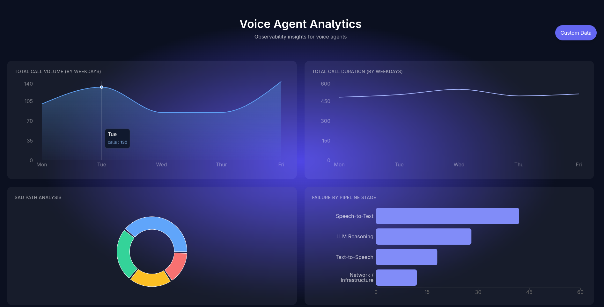

# Voice Agent Analytics Dashboard

A React + TS web application that visualizes voice agent call analytics with an interactive, SuperBryn-inspired dark analytics theme. Users can input custom data and visualize insights through dynamic charts.

## 🚀 Live Demo
https://voice-agent-analytics-dashboard.vercel.app/

## 🧠 What This App Does
* Displays call analytics using an interactive area chart
* Shows sad path analysis using a donut chart
* Allows users to:
  * Enter their email
  * Customize call values
  * Persist data using Supabase
  * See previous values and confirm before overwriting
* Charts are updated instantly based on user input

## 📊 Features
1. Call Analytics (Area Chart)
* Visualizes call volume trends
* Data updates dynamically when the user saves new values
* Styled for dark dashboards with custom gradients and tooltips

2. Sad Path Analysis (Donut Chart)
* Represents common failure scenarios in voice agents
* Uses dummy data

3. Email-Based Persistence
* User data is stored in Supabase keyed by email
* On re-entry of calls data, previous values are shown with overwrite confirmation

## 🛠 Tech Stack
* Frontend: React + TypeScript
* Build Tool: Vite
* Styling: Tailwind CSS
* Charts: Recharts
* Database: Supabase (PostgreSQL)
* Deployment: Vercel

## 🤖 Use of AI Tools
AI tools were used to:
* Align styling with Superbryn
* Optimize chart configuration and tooltip accessibility
* Speed up development while maintaining clean, readable code

## 🖌 Design Inspiration
The UI follows dark analytics theme, characterized by:
* Radial gradient background
* Glassmorphism cards
* Soft typography hierarchy
* Minimal, high-contrast charts

SuperBryn - a Voice AI Reliability Platform

### Preview
